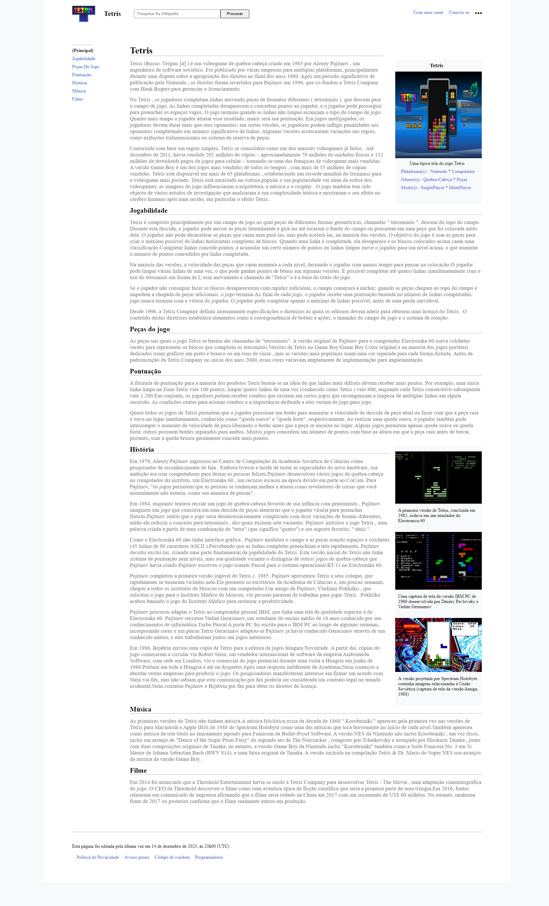

<h1 align="center">Tetris - Wikipédia</h1>

  

## 🚀 Tecnologias

Esse projeto foi desenvolvido com as seguintes tecnologias:

- HTML e CSS
- Git e Github

## 💻 Projeto
Projeto criado com o intuíto de estilizarmos uma página Web semelhanda a Wikipédia utilizando as novas tags do HTML 5, com foco na semântica e acessibilidade.

## :memo: Licença